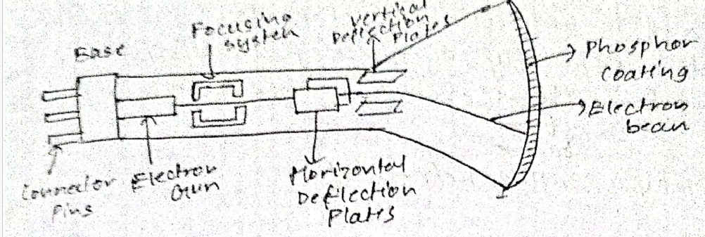

# Computer Graphics
Computer graphics is the creation, modification and storage of models and images

## Applications of Computer Graphics
### CAD
- Computer-Aided Design is the use of computers to create and manipulate and document 2D or 3D models of objects.
- It helps with designing, visualizing and planning.
- It is used in architecture, engineering, etc.

### Presentation Graphics
- Presentation Graphics are an area of application programs where a series of images and texts are used to tell a story or presentation of information. 
- It is used to produce illustration for reports.
- It is used for financial, economic, mathematical, and statistical reports.
- Eg: barchart, line graph

### Entertainment
- Computer Graphics are used to produce animations for movies to produce realistic effects, as well as in music videos.

### GUI
- Graphical User Interface provide a visual interface to users to interact with applications using graphical components such as icons, menus, and buttons.

### Image Processing
- Image processing works by converting a photograph into a digital format
- Treats the digital format as a 2D signal
- Applies various algorithms to analyze or manipulate the image
- Can be used for improving shading, rearrange the picture, etc.

## Cathode Ray Tube

- A beam of electrons are emitted by the electron gun, passes through the focussing and deflection system which directs the beam towards the specified position on the phosphor-coated screen.
- The phosphor emits light where the electron strikes it which fades when electron flow stops so we need a way to keep the light going.
- We can do this by directing the electrons through the same positions over and over to sustain the picture. This is known as Refresh CRT.
- The primary components of a CRT are
    - Heated metal
    - Cathode
    - Control grid
- Heat is applied to the cathode by directing current through a coil of wire called the filament.
- Inside the cathode, a cloud of free electrons is formed due to thermionic emission.
- The free electrons are accelerated toward the phosphor coating with high +ve voltage.
- The intensity of the electron bean is controlled by controlling the voltage on the control grid.
    - High -ve voltage ----> stops electrons from passing the end of control grid
    - Low -ve voltage ----> decreases the number of electrons passing through
- This is how we can control the brightness of the display.

### Characteristics of CRT
#### Persistence
- How long the phosphor emits light after the electron beam has been removed
- Persistence is defined as the amount of time it takes for the emitted light from the screen to decay to 1/10th of it's original intensity

#### Aspect Ratio
- Ratio of vertical points to horizontal points

#### Resolution
- Maximum no. of points that can be displayed without overlap on a CRT
